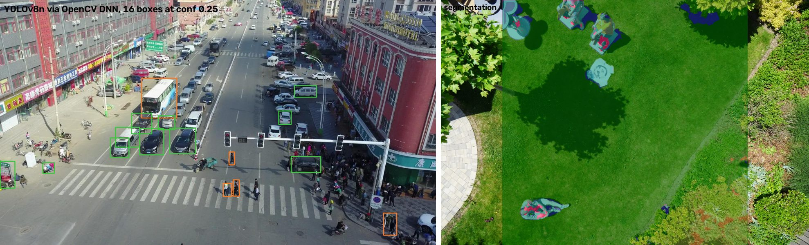
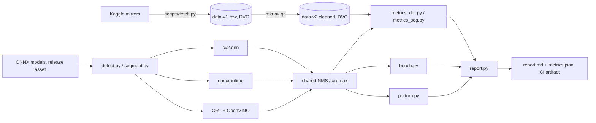
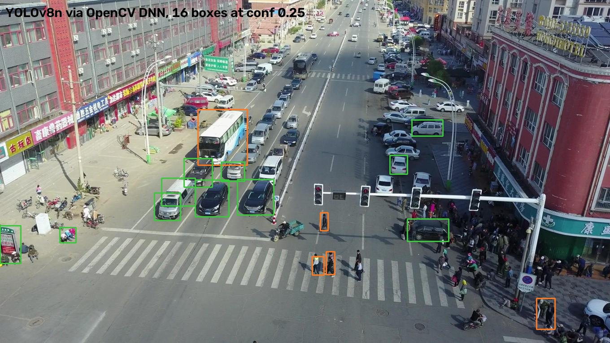
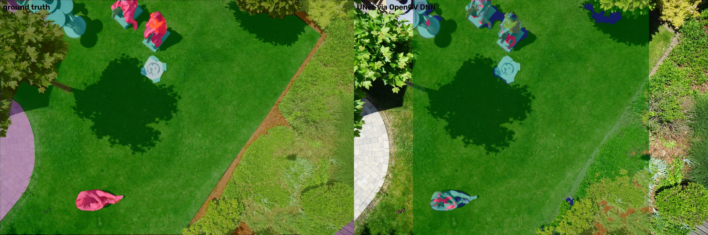
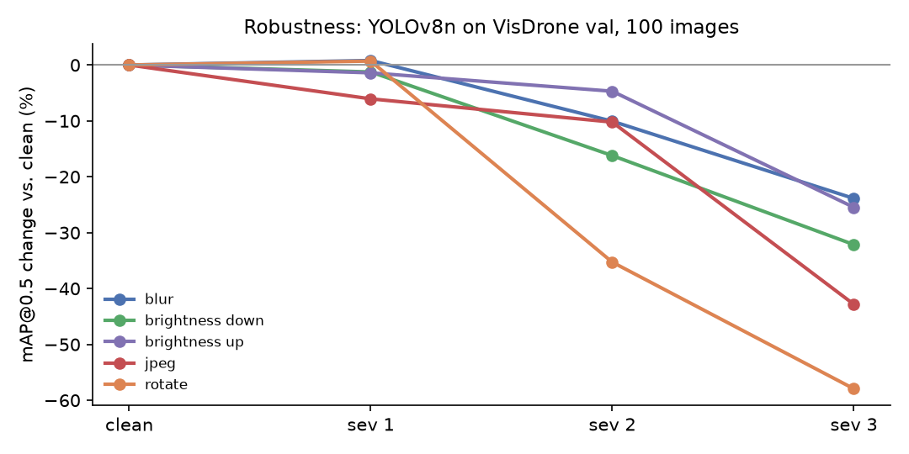

<h1 align="center">mk-uav-eval</h1>
<p align="center">An OpenCV evaluation harness for versioned UAV datasets: annotation QA, OpenCV DNN and onnxruntime inference, metrics cross-checked against pycocotools and torchmetrics, latency, robustness, and a report published by CI on every push.</p>

<p align="center">
  <a href="https://github.com/MaheshBhushan/mk-uav-eval/actions/workflows/ci.yml"></a>
  <a href="LICENSE"></a>
  
  
</p>
<p align="center">
  <a href="https://github.com/MaheshBhushan/mk-uav-eval/actions/workflows/ci.yml">Latest report (CI artifact)</a> ·
  <a href="https://github.com/MaheshBhushan/mk-uav-eval/releases/tag/models-v1">Models</a> ·
  <a href="https://www.kaggle.com/code/kodurimahesh/mk-uav-seg-finetune">Training kernel</a> ·
  <a href="#results">Results</a> ·
  <a href="#quickstart">Quickstart</a>
</p>



## Overview

Evaluating a vision model on drone imagery has three failure modes that a training
script never shows you: the annotations are wrong, the metric implementation is
wrong, or the number you quote was measured on a different backend than the one
you deploy. This repo attacks all three. It validates VisDrone boxes and ICG
semantic masks with named QA rules and stores the raw and cleaned datasets as two
DVC versions. It runs the same ONNX file through OpenCV DNN, onnxruntime and the
onnxruntime OpenVINO provider with one shared pre- and post-processing path, so
the forward pass is the only variable. Its own mAP and mIoU implementations are
asserted equal to pycocotools and torchmetrics in the test suite.

The harness is the deliverable. The models are pretrained COCO YOLOv8n and a
small UNet trained from scratch, and their absolute scores are low on purpose.

## Quickstart

```bash
git clone https://github.com/MaheshBhushan/mk-uav-eval.git && cd mk-uav-eval
uv sync --extra cpu --extra dev                              # or --extra openvino instead of cpu
gh release download models-v1 -p "*.onnx" -D models/         # 12 MB YOLOv8n + 31 MB UNet
cp -r data/ci_subset/. data/                                 # 50 VisDrone + 20 ICG images, committed
uv run pytest -q                                             # 15 tests, ~20 s
uv run mkuav report --subset 50 --backend ort --out report.md --json metrics.json
```

That is exactly what CI runs, in about two minutes. For the full datasets:

```bash
export KAGGLE_API_TOKEN=...                                  # kaggle.com/settings
uv run python scripts/fetch.py                               # VisDrone val (548) + ICG (400), ~6 GB download
uv run mkuav report --backend ort
```

> [!NOTE]
> `onnxruntime` and `onnxruntime-openvino` overwrite each other's files, so they are mutually exclusive uv extras. Pick `cpu` or `openvino`, never both. `uv run dvc pull` only works against the author's local DVC remote; everyone else fetches from Kaggle or uses the committed subset.

## What it does

| Stage | Command | Output |
|---|---|---|
| Annotation QA | `mkuav qa --version v1\|v2` | rule counts per dataset, `qa_report_*.json` |
| Dataset versioning | DVC, git tags `data-v1` (raw) and `data-v2` (cleaned) | `data/*.dvc` |
| Detection | `mkuav detect`, `mkuav eval-det` | boxes; per-class AP, mAP@0.5, mAP@0.5:0.95, P/R |
| Segmentation | `mkuav segment`, `mkuav eval-seg` | class map PNG; per-class IoU, mIoU, pixel accuracy |
| Latency | `mkuav bench` | p50 / p95 per backend |
| Robustness | `mkuav robust` | mAP under blur, brightness, JPEG, rotation |
| Report | `mkuav report` | `report.md`, `metrics.json`, per-stage JSON |



## Results

Every number here comes from `mkuav report` on `main`, on a laptop i5-1135G7 unless stated.

### Annotation QA, VisDrone val, raw (v1)

| Rule | Boxes | Files |
|---|---|---|
| ignored_region | 1378 | 340 |
| others_class | 32 | 29 |
| tiny_box (< 16 px², informational) | 103 | 45 |

Zero-area, out-of-bounds, duplicate, malformed and score-zero rows: none in this
split. ICG masks: 0 invalid class ids, 0 dimension mismatches, 23 of 24 classes
present. Because the only cleaning that mattered was dropping category 0 and 11
rows the loader already ignores, v1 and v2 score identically, and the report
says so instead of implying the cleaning moved the number. Ignored regions are
kept and used at evaluation time to suppress predictions inside them.

### Detection, YOLOv8n COCO weights, VisDrone val v2, 548 images

COCO classes are mapped onto six merged VisDrone classes. Tricycle classes have
no COCO equivalent and are excluded.

| Class | GT boxes | AP@0.5 | AP@0.5:0.95 | P@0.25 | R@0.25 |
|---|---|---|---|---|---|
| car | 16039 | 0.396 | 0.231 | 0.801 | 0.299 |
| person | 13969 | 0.148 | 0.057 | 0.769 | 0.076 |
| bus | 251 | 0.106 | 0.080 | 0.225 | 0.179 |
| truck | 750 | 0.037 | 0.026 | 0.247 | 0.049 |
| motor | 4886 | 0.021 | 0.008 | 0.695 | 0.008 |
| bicycle | 1287 | 0.010 | 0.009 | 0.286 | 0.002 |
| **all** | 37182 | **0.120** | **0.069** | 0.769 | 0.161 |

The weights never saw drone imagery and VisDrone objects are tiny, so low recall
is expected. What the harness proves is that the AP implementation matches
pycocotools to 2.8e-17 on the CI subset (`tests/test_metrics_det.py`).



### Segmentation, from-scratch UNet, ICG Semantic Drone, 40 held-out images

| Metric | Value |
|---|---|
| mIoU, 24 classes | 0.167 |
| pixel accuracy | 0.721 |

Plain-convolution UNet, 360 training images, 25 epochs, ten minutes on a Kaggle
T4 (`notebooks/seg_finetune.py`). Large classes such as paved area and grass
score well, rare ones such as AR markers and bicycles score zero. OpenCV DNN and
onnxruntime produce identical argmax maps, and mIoU matches torchmetrics to 1e-5
(`tests/test_metrics_seg.py`). Only the 40 stems the kernel never trained on are
scored; `mkuav eval-seg --all` gives the optimistic number.



### Latency, one 640 px image, 4 threads, p50 in ms

| Backend | Laptop i5-1135G7 | GitHub runner, EPYC 9V74 |
|---|---|---|
| cv2 (OpenCV DNN) | 93 | 117 |
| ort-cpu | 86 | 218 |
| ort-openvino, CPU device | 49 | n/a, plain onnxruntime build |

OpenVINO halves the onnxruntime time on the same cores because its CPU plugin
fuses and re-tiles the convolutions for the specific ISA at load time, where the
default onnxruntime CPU provider runs generic kernels. OpenVINO's GPU device on
the Iris Xe segfaults inside the provider; the benchmark probes it in a
subprocess and records it as unavailable. If onnxruntime silently drops a
requested provider, the loader raises rather than reporting a CPU number under
the wrong name.

### Robustness, mAP@0.5 relative to clean, 100 images



Severity 0 of every perturbation reproduces the unperturbed mAP exactly. JPEG
quality 8 and 30° rotation hurt most. Rotated ground truth uses the enclosing
axis-aligned box, so rotation is a lower bound.

## Repository structure

```
.github/workflows/ci.yml   tests + report on the committed subset, artifacts uploaded
assets/                    images in this README, generated by the harness
data/ci_subset/            50 VisDrone + 20 ICG images committed for CI
data/*.dvc                 DVC pointers for the full datasets (local remote)
models/                    ONNX files land here (release asset), class list, training log
notebooks/seg_finetune.py  Kaggle script kernel that trains and exports the UNet
scripts/fetch.py           Kaggle download + layout for both datasets
src/mkuav/
  cli.py                   argparse entry point, one subcommand per stage
  qa.py                    annotation rules and the v2 cleaning step
  detect.py  segment.py    backend-agnostic loaders, shared pre/post-processing
  metrics_det.py           COCO-style AP, class mapping, ignored-region filter
  metrics_seg.py           confusion-matrix IoU, holdout selection
  bench.py  perturb.py     latency and robustness
  report.py                Markdown + JSON rendering
tests/                     15 tests incl. pycocotools and torchmetrics cross-checks
```

## Limitations

- COCO weights, not fine-tuned on VisDrone. Absolute mAP is low by design.
- Tricycle and awning-tricycle GT are excluded, person/people and car/van are merged.
- Ignored-region filtering is a centre-point approximation of the VisDrone protocol.
- The segmentation model has no pretrained encoder and 360 training images; it exists to exercise the harness.
- Robustness is measured on 100 images, all other detection numbers on 548.

## Acknowledgements

Data comes from [VisDrone2019-DET](http://aiskyeye.com/) (Zhu et al., *Detection and Tracking Meet Drones Challenge*, TPAMI 2021) via the Kaggle mirror `hassanmojab/visdrone-det`, and the [ICG Semantic Drone Dataset](http://dronedataset.icg.tugraz.at/) (TU Graz) via `bulentsiyah/semantic-drone-dataset`. Both are for non-commercial research use under their own terms. Detection weights are Ultralytics YOLOv8n, exported once to ONNX.

## License

MIT. See [LICENSE](LICENSE).
